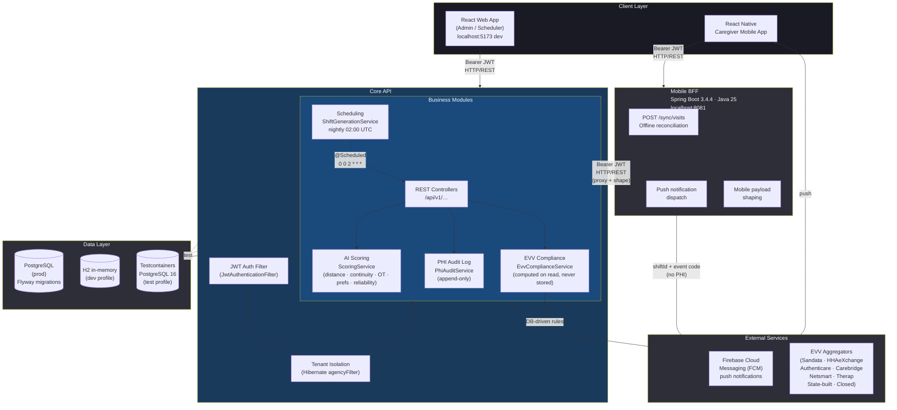

# hcare

**hcare** is a multi-tenant home care agency management SaaS platform for small agencies (1–25 caregivers). It combines shift scheduling with AI-assisted caregiver matching, Electronic Visit Verification (EVV) compliance tracking, a caregiver mobile app, client and care plan management, and a family portal — all under a single versioned REST API.

---

## Table of Contents

- [Core Features](#core-features)
- [Repository Structure](#repository-structure)
- [Domain Model](#domain-model)
- [Production Architecture](#production-architecture)
- [Prerequisites](#prerequisites)
- [Quick Start (Dev)](#quick-start-dev)
- [Service-by-Service Setup](#service-by-service-setup)
- [Environment Variables](#environment-variables)
- [Dev Credentials](#dev-credentials)
- [Running Tests](#running-tests)
- [Key Architecture Decisions](#key-architecture-decisions)
- [Contributing](#contributing)

---

## Core Features

| Feature | Detail |
|---|---|
| Shift scheduling | Rolling 8-week horizon generated nightly from `RecurrencePattern` instances; ad-hoc shifts supported |
| AI caregiver matching | Weighted score across distance (30%), continuity (25%), overtime risk (20%), preferences (15%), reliability (10%); gated by `aiSchedulingEnabled` feature flag |
| EVV compliance | Six federal elements captured per visit; compliance status (`GREEN / YELLOW / RED / EXEMPT / PORTAL_SUBMIT / GREY`) computed on read from DB-driven state rules — never stored |
| Multi-tenancy | Row-level isolation via Hibernate `agencyFilter`; every tenant entity carries `agencyId` |
| Care plan management | Versioned care plans with goals, ADL tasks, and optional clinical review sign-off |
| Family portal | Read-only portal access for client family members (`FamilyPortalUser`) |
| PHI audit log | Append-only `PhiAuditLog` with per-request IP and user agent capture |
| Authorization tracking | Real-time utilization against payer-authorized units with optimistic-lock concurrency |
| Mobile offline sync | BFF reconciles offline EVV records captured by the React Native app (`POST /sync/visits`) |
| Feature flags | Per-agency flags (`aiSchedulingEnabled`, `familyPortalEnabled`) — ship web and mobile independently |

---

## Repository Structure

```
hcare/
├── backend/          # Core API — Spring Boot 3.4.4, Java 25 (system of record)
├── bff/              # Mobile BFF — Spring Boot 3.4.4, Java 25 (stateless adapter for React Native)
├── frontend/         # Web admin app — React 19, TypeScript, Tailwind CSS
├── mobile/           # Caregiver mobile app — React Native
├── dev-start.sh      # Start backend + frontend concurrently
└── dev-stop.sh       # Stop both processes
```

### Backend package layout (`com.hcare`)

| Package | Responsibility |
|---|---|
| `domain/` | JPA entities and Spring Data repositories |
| `api/v1/` | REST controllers and DTO records (auth, caregivers, clients, scheduling, EVV, visits, dashboard, documents, payers, service types, users) |
| `scheduling/` | `ShiftGenerationService` + `ShiftGenerationScheduler` (nightly cron, 2 AM UTC) |
| `scoring/` | `ScoringService` interface + `LocalScoringService` (all AI logic isolated here) |
| `evv/` | `EvvComplianceService`, `EvvStateConfig`, aggregator type routing |
| `audit/` | `PhiAuditLog`, `PhiAuditService` |
| `multitenancy/` | `TenantContext`, `TenantFilterInterceptor`, `TenantFilterAspect` |
| `security/` | `JwtTokenProvider`, `JwtAuthenticationFilter`, `UserPrincipal` |
| `config/` | `SecurityConfig`, `WebMvcConfig`, `SchedulingConfig`, `DevDataSeeder` |
| `exception/` | `GlobalExceptionHandler` (`@ControllerAdvice`), `ErrorResponse` |

---

## Domain Model

**Agency** — top-level tenant. Has many `AgencyUser` (ADMIN | SCHEDULER), `Caregiver`, `Client`, `Payer`, `ServiceType`, and one `FeatureFlags` row.

**Caregiver** — belongs to an agency. Has credentials (with expiry), background checks, weekly availability windows, and one `CaregiverScoringProfile` that tracks cancel rate and hours. The scoring profile in turn holds `CaregiverClientAffinity` records (visit history per client, used by the AI match engine).

**Client** — belongs to an agency. Has versioned `CarePlan` records, diagnoses, medications, `Authorization` records (payer + authorized units with real-time utilization), and `FamilyPortalUser` records (family members with read-only portal access).

**RecurrencePattern → Shift** — a recurrence pattern generates `Shift` instances on a rolling 8-week horizon (nightly job). Each shift references a client, caregiver, service type, and optionally an authorization. Shift status: `OPEN → ASSIGNED → IN_PROGRESS → COMPLETED` (or `CANCELLED` / `MISSED`).

**Shift → EvvRecord** — one optional EVV record per shift capturing the six federal elements (location, time-in, time-out, verification method, client Medicaid ID, caregiver ID). Compliance status is computed on read from `EvvStateConfig` rules — never stored.

**Shift → ShiftOffer / AdlTaskCompletion** — offers track caregiver accept/decline responses; ADL task completions document care activities performed during the visit.

**EvvStateConfig** — global reference table (no `agencyId`), one row per US state, Flyway-seeded. Controls GPS tolerance, allowed verification methods, aggregator routing, and compliance thresholds.

**PhiAuditLog** — append-only, stored in a separate schema partition. Captures every PHI access with user, resource, action, IP, and timestamp.

All entities except `EvvStateConfig` and `PhiAuditLog` carry `agencyId` and are isolated by the Hibernate `agencyFilter`.

---

## Production Architecture



### EVV compliance status values

| Status | Meaning |
|---|---|
| `GREY` | No `EvvRecord` exists yet (visit not started) |
| `EXEMPT` | `PRIVATE_PAY` payer or no authorization linked; co-resident caregiver |
| `GREEN` | All 6 federal elements present, method allowed, GPS within tolerance, no time anomaly |
| `YELLOW` | All elements present but one exception applies (manual override, GPS drift, time anomaly, unacknowledged closed-state) |
| `PORTAL_SUBMIT` | Closed-state with agency acknowledgment — agency submits via state portal |
| `RED` | Required element missing, no clock-out, or missed visit without documentation |

Status is computed stateless by `EvvComplianceService.compute()` on every read. Updating an `EvvStateConfig` row re-evaluates all historical visits immediately with no reprocessing job.

### AI scoring weights

| Factor | Weight | Notes |
|---|---|---|
| Distance | 30% | Haversine; 0.5 neutral when coordinates missing; 0 at 25 miles |
| Continuity | 25% | Visit count with this client; saturates at 10 visits |
| Overtime risk | 20% | 0 if projected week hours ≥ 40 |
| Preferences | 15% | Language match −0.5; pet conflict −0.2 |
| Reliability | 10% | `1 − cancelRate` (lifetime running total) |

Scoring is gated by `FeatureFlags.aiSchedulingEnabled`. When `false` (Starter tier), `ScoringService.rankCandidates()` returns eligible caregivers unsorted with `score=0`.

---

## Prerequisites

| Requirement | Version |
|---|---|
| Java | 25 |
| Maven | 3.9+ |
| Node.js | 22+ (LTS) |
| npm | 10+ |

No external database is needed for development — the backend uses H2 in-memory (PostgreSQL-compatibility mode). Tests use Testcontainers PostgreSQL 16 (requires Docker).

---

## Quick Start (Dev)

The root convenience scripts start both services, wait for readiness, and open Chrome:

```bash
./dev-start.sh   # starts backend (dev profile) + frontend concurrently
./dev-stop.sh    # kills both processes
```

Logs are written to `/tmp/hcare-backend.log` and `/tmp/hcare-frontend.log`.

Once running:

| Service | URL |
|---|---|
| Web admin | http://localhost:5173 |
| Core API | http://localhost:8080 |
| H2 console | http://localhost:8080/h2-console |

Log in with `admin@sunrise.dev` / `Admin1234!` (see [Dev Credentials](#dev-credentials)).

---

## Service-by-Service Setup

### Backend (Core API)

```bash
cd backend
mvn spring-boot:run                        # dev server on :8080 (H2, dev profile)
SPRING_PROFILES_ACTIVE=dev mvn spring-boot:run   # explicit profile
mvn test                                   # JUnit 5 + Testcontainers
mvn verify                                 # compile, test, package
mvn flyway:info                            # check migration status
mvn test -Dtest=ClassName                  # run a single test class
```

### Mobile BFF

```bash
cd bff
mvn spring-boot:run    # :8081
mvn test
```

### Frontend (Web Admin)

```bash
cd frontend
npm run dev            # Vite dev server on :5173
npm run build          # production build (tsc + vite build)
npm run test           # Vitest unit tests
npm run test:e2e       # Playwright end-to-end tests
npm run lint --fix     # ESLint + Prettier (run before committing)
```

---

## Environment Variables

### Backend

| Variable | Required in prod | Default (dev) | Description |
|---|---|---|---|
| `SPRING_PROFILES_ACTIVE` | Yes | `dev` | `dev` / `staging` / `prod` |
| `JWT_SECRET` | Yes | insecure dev default | HMAC-SHA256 secret, minimum 256 bits |
| `DATABASE_URL` | Yes (prod) | H2 in-memory | JDBC URL for PostgreSQL |
| `DATABASE_USERNAME` | Yes (prod) | `sa` | Database username |
| `DATABASE_PASSWORD` | Yes (prod) | _(empty)_ | Database password |
| `HCARE_STORAGE_PROVIDER` | No | `local` | Storage provider (`local` or cloud) |
| `HCARE_DOCUMENTS_DIR` | No | `/var/hcare/documents` | Local document storage path |
| `HCARE_STORAGE_SIGNING_KEY` | Yes (prod) | dev default | Document URL signing key |
| `HCARE_BASE_URL` | No | `http://localhost:8080` | Base URL for signed document links |
| `HCARE_SCORING_WEEKLY_RESET_CRON` | No | `0 0 0 * * MON` | Weekly hour reset cron; set to `-` in tests |
| `HCARE_PORTAL_JWT_SECRET` | **Yes** | _(none — startup fails without it)_ | HMAC-SHA256 secret for family portal JWTs; must differ from `JWT_SECRET` |
| `HCARE_PORTAL_BASE_URL` | No | `http://localhost:5173` | Base URL prepended to invite links sent to family members |
| `HCARE_PORTAL_JWT_EXPIRATION_DAYS` | No | `30` | Lifetime of a family portal JWT in days |

JWT token lifetime is 24 hours (`expiration-ms: 86400000`). Virtual threads are enabled globally (`spring.threads.virtual.enabled: true`). `TenantContext` uses plain `ThreadLocal` — safe because each virtual thread has isolated `ThreadLocal` storage.

### Frontend

| Variable | Default | Description |
|---|---|---|
| `VITE_API_BASE_URL` | `http://localhost:8080/api/v1` | Core API base URL |
| `VITE_FEATURE_FLAGS_URL` | _(unset)_ | Feature flags endpoint |

> Production requires a real `JWT_SECRET` and external PostgreSQL. Never commit secrets to `.env` files.

---

## Dev Credentials

Three agencies are seeded by `DevDataSeeder.java` (`dev` profile only). All passwords are `Admin1234!`.

| Agency slug | Admin | Scheduler |
|---|---|---|
| `sunrise` | `admin@sunrise.dev` | `scheduler@sunrise.dev` |
| `golden` | `admin@golden.dev` | `scheduler@golden.dev` |
| `harmony` | `admin@harmony.dev` | `scheduler@harmony.dev` |

The seeder covers all six EVV compliance statuses (GREEN, YELLOW, RED, EXEMPT, GREY). `PORTAL_SUBMIT` requires manually updating a `CLOSED`-system state's `closedSystemAcknowledgedByAgency` flag in `evv_state_configs`.

---

## Running Tests

### Backend

```bash
cd backend
mvn test          # JUnit 5 + Mockito; Testcontainers PostgreSQL 16 for integration tests
```

The nightly scheduler cron and scoring weekly-reset cron are disabled in `application-test.yml` (set to `-`). Tests call `advanceGenerationFrontier()` directly.

### Frontend

```bash
cd frontend
npm run test        # Vitest unit tests (80% coverage target)
npm run test:e2e    # Playwright e2e (critical user flows)
```

Use constants from `frontend/src/mock/data.ts` in Vitest tests — these are typed fixtures with fixed UUIDs matching the seeded dev data. Do not invent UUIDs in tests.

| Layer | Tool | Minimum coverage target |
|---|---|---|
| Frontend unit | Vitest + Testing Library | 80% |
| Frontend e2e | Playwright | Critical user flows |
| Backend unit | JUnit 5 + Mockito | 80% |

---

## Key Architecture Decisions

### Multi-tenancy — framework-enforced, not service-enforced

`TenantFilterInterceptor` sets `TenantContext` (ThreadLocal) from the JWT `agencyId` claim. `TenantFilterAspect` enables the Hibernate `agencyFilter` before every `@Transactional` repository call. `TenantContext` is cleared in `afterCompletion`. Cross-agency leakage is impossible at the persistence layer — never re-enforce it in service code.

### Core API is the single system of record

The Mobile BFF (`/bff`) is a stateless thin adapter with no database. It shapes payloads for mobile clients, dispatches push notifications (carrying only `shiftId` and an event type code — never PHI), and reconciles offline sync. EVV compliance status is **never** computed or stored in the BFF; it proxies Core API and forwards the result.

### EVV compliance is computed on read

`EvvComplianceService.compute()` is stateless — it accepts pre-loaded `EvvRecord` and `EvvStateConfig` objects and makes no database calls. Rules are DB-driven: changing an `EvvStateConfig` row re-evaluates all historical visits instantly.

### AI scoring is a contained module

All scoring logic lives in `com.hcare.scoring`. The only public surface is `ScoringService.rankCandidates()`. Scoring profiles (`CaregiverScoringProfile`) and affinity records (`CaregiverClientAffinity`) are updated asynchronously via `@TransactionalEventListener` on `ShiftCompletedEvent` / `ShiftCancelledEvent` — never on the request path. Nothing outside `com.hcare.scoring` queries the scoring tables directly.

### Authorization utilization uses optimistic locking

`Authorization` and `CaregiverClientAffinity` use `@Version` to guard concurrent updates (e.g. two simultaneous clock-outs). Spring wraps `StaleObjectStateException` as `ObjectOptimisticLockingFailureException`; callers retry. The nightly shift generator applies the same pattern on `RecurrencePattern`.

### Frontend state management

React Query manages all server state. Zustand (`authStore`) holds only client-side auth state (`token | userId | agencyId | role`). Components never fetch data directly — use a custom hook wrapping React Query.

---

## Contributing

- Follow [Conventional Commits](https://www.conventionalcommits.org/): `feat:`, `fix:`, `chore:`, `docs:`, etc.
- Run `npm run lint --fix` in `frontend/` before committing TypeScript changes.
- Java style is enforced by Checkstyle (Google Java Style).
- Keep PRs small and focused — one logical change per PR.
- Never commit with failing tests.
- Do not introduce new dependencies without explaining why in the PR description.
- Secrets belong in environment variables or a secrets manager — never in code or committed `.env` files.
- Dependencies are scanned on every PR; address HIGH/CRITICAL CVEs before merging.

---

## License

Private — all rights reserved.
